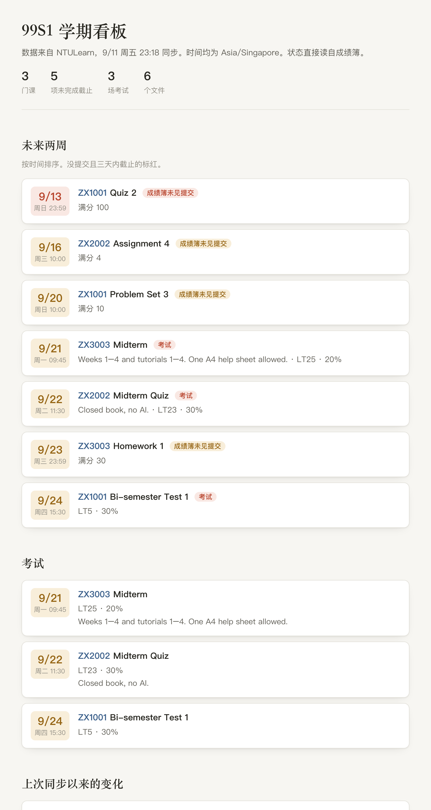
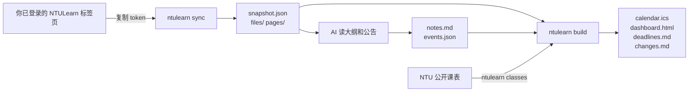

# ntulearn-digest

把 NTULearn 上零散的课程信息，自动整理成**一份日历、一个截止日期看板，和每门课一份 AI 能读懂的资料**。

[English](README.en.md) · 非 NTU 官方工具



## 它解决什么问题

每学期开学，七八门课的考试时间、quiz、作业截止、老师公告分散在不同课站、不同 PDF 和成绩簿里。这个项目分两层：

| 层 | 谁来做 | 做什么 |
|---|---|---|
| 抓取与生成 | `ntulearn` 命令行 | 读课程列表、内容树、成绩簿、公告，下载全部文件，生成 `.ics` 日历、HTML 看板、Markdown 汇总，并和上一次同步做对比 |
| 阅读与整理 | Claude Code 等 AI 助手 | 读课程大纲和公告，整理每门课的考核方式、政策、逐周内容；把只写在 PDF 里的期中、期末时间补进日历 |

成绩簿里有截止时间的项目，程序直接放进日历。考试时间通常只写在课程大纲里，这部分交给 AI 读出来，写进 `events.json`，再重新生成日历。



## 快速开始

需要 Python 3.9 或更新版本，不依赖任何第三方库。

```bash
git clone https://github.com/ericwu666666/ntulearn-digest.git
cd ntulearn-digest
python3 -m venv .venv && source .venv/bin/activate   # Windows: .venv\Scripts\activate
pip install -e .
ntulearn demo        # 先用虚构数据看看效果，输出在 demo-output/
```

### 1. 复制登录 token

1. 用 Chrome 或 Edge 打开 NTULearn 并正常登录。
2. 按 F12（Mac 是 ⌥⌘J）打开控制台，粘贴 [`tools/get_token.js`](tools/get_token.js) 里的那一行，回车。token 会进入剪贴板。
3. 回到终端：

```bash
ntulearn auth --clipboard
```

token 大约一小时后过期，过期了重复这一步即可。程序从头到尾碰不到你的密码。token 只保存在本机 `~/.config/ntulearn-digest/token`，文件权限是仅自己可读。

### 2. 同步

```bash
ntulearn sync
```

默认只抓最新学期（按课程编号前缀，如 `26S1`），下载所有文件，然后生成输出。常用选项：

| 选项 | 作用 |
|---|---|
| `--term 26S1` | 指定学期 |
| `--course HE3001` | 只同步这门课，可以写多次 |
| `--no-download` | 只抓数据，不下载文件 |
| `-o 文件夹` | 输出位置，默认 `ntulearn-output/` |
| `--workers 4` | 并发数。请保持较小，别给学校服务器添压力 |

再次运行只会下载新文件，并在 `changes.md` 里列出新公告、新成绩项、改过的截止时间和新出的成绩。

### 3. 加上每周课表（可选）

NTULearn 不提供上课时间，但 NTU 的公开课表有。填你在 STARS 里的 index，或者组别：

```bash
ntulearn classes HE3001:19541 HW0218:GP12 \
  --acadsem "2026;1" --week1 2026-08-10 --skip 2026-11-09
```

`--week1` 是教学第一周的周一。程序默认第 7 周后有一周 recess。公共假期不会自动排除，用 `--skip` 列出来。

### 4. 让 AI 补齐考试时间和课程要点（可选）

仓库自带 Claude Code 技能 [`.claude/skills/ntulearn-digest`](.claude/skills/ntulearn-digest/SKILL.md)。在仓库目录里打开 Claude Code，说一句「更新 NTULearn」，它会：

1. 运行同步，先看 `changes.md`；
2. 读有变化的课程大纲、考试通知和公告，写每门课的 `notes.md`，包括考核占比、形式、政策、逐周内容和每个数字的出处；
3. 把成绩簿里没有的考试和展示写进 `events.json`，重新生成日历；
4. 告诉你三天内要做什么。

不用 Claude Code 也可以：照 [`examples/events.example.json`](examples/events.example.json) 手写 `events.json`，放进输出文件夹，运行 `ntulearn build`。

## 输出

```
ntulearn-output/
├── dashboard.html              看板：未来两周、考试、变化、各门课、全部截止
├── calendar.ics                课表 + 考试 + 截止，导入 Apple / Google / Outlook 日历
├── calendar-deadlines-exams.ics 不含每周课表的版本
├── deadlines.md                同样内容的文字版
├── changes.md                  和上一次同步相比的变化
├── items.json                  所有日期项，方便 AI 或脚本使用
├── snapshot.json               原始整理数据
├── events.json                 你或 AI 补充的考试等事件
├── classes.json                每周上课时间
└── courses/<课程>/
    ├── overview.md             成绩簿、公告全文、内容结构
    ├── notes.md                AI 整理的考核与政策（第 4 步生成）
    ├── pages/                  Ultra 页面正文
    └── files/                  按课站文件夹结构下载的文件
```

截止事项在日历里显示为截止前 30 分钟的一个时间块，并提前一天和三小时提醒。已经提交或评分的项目不再提醒。

## 原理

NTULearn 是 Blackboard Learn Ultra。网页在浏览器的 sessionStorage 里保存了一个短期访问 token，同一个 token 可以调用 Blackboard 的公开 REST 接口 `/learn/api/public/v1`。这个工具只发 GET 请求，只读你自己能看到的内容：

- `users/me/courses`：课程列表，并逐门确认你是否仍在课上，用来发现退课
- `courses/{id}/contents` 及子节点：内容树和附件
- `contents/{id}?fields=body`：Ultra 页面正文。页面里拖进去的文件只出现在正文里，附件接口拿不到
- `gradebook/columns` 和 `gradebook/users/{me}`：截止时间、满分和你的提交状态
- `announcements`：公告

## 隐私、版权与使用边界

- **不要把输出文件夹提交到 GitHub 或分享给别人。** 里面是老师的课件和你的成绩。`.gitignore` 已经排除了默认输出目录。
- 课件版权属于老师和学校，只供你自己学习使用。
- token 等同于一小时内的登录状态，不要发给任何人。
- 这是个人学习用的非官方工具，与 NTU 和 Blackboard 无关。使用前请自行确认符合学校的 IT 使用规定。程序默认低并发、自动退避重试，请不要调高并发或频繁运行。
- 「成绩簿未见提交」只代表成绩簿里没有记录。Turnitin、问卷类提交可能不会显示，请以课站为准。

## 局限

- 只在 NTULearn 上测试过。其他学校的 Blackboard Ultra 可以用 `--base-url` 试试，token 的位置可能不同。
- 课程已关闭（Closed）后，文件下载会被拒绝。
- 考试时间、考核占比这类信息只存在于 PDF 里，需要第 4 步的 AI 或手工补充。

## 开发

```bash
python -m unittest discover -s tests -v
```

测试用虚构数据模拟 Blackboard 接口，不需要网络和账号。欢迎提 issue 和 PR。

## License

MIT
